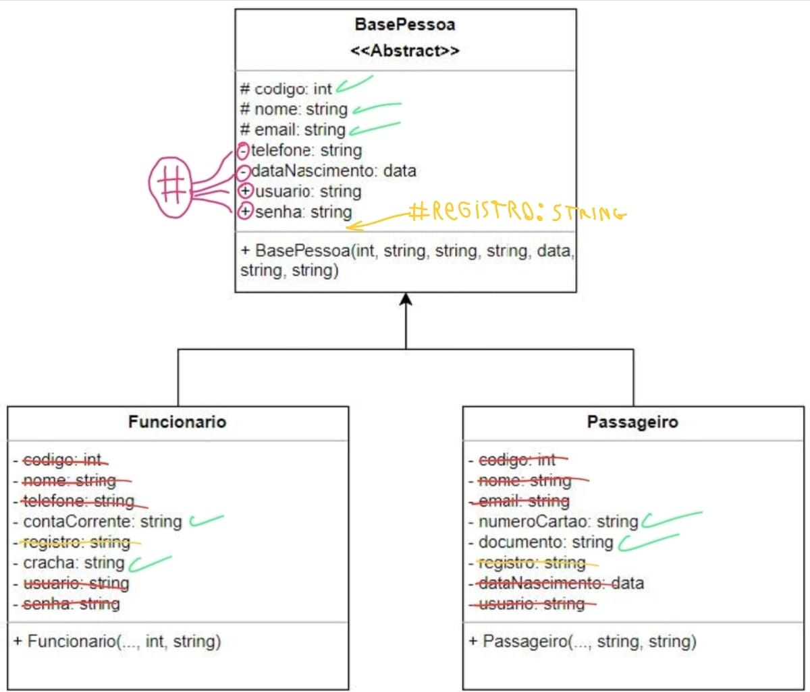
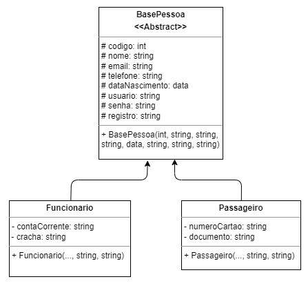

# Atividade 04

| Academico:    | [José A. Q. C. Gomes `@JoseComparotto`](https://github.com/JoseComparotto)                                                                   | RA: 398439413114     |
| ------------- | -------------------------------------------------------------------------------------------------------------------------------------------- | :------------------: |
| Curso:        | Engenharia da Computação                                                                                                                     | Noturno              |
| Professor:    | [Luiz Augusto Rodrigues `@profluizao`](https://github.com/profluizao)                                                                        |                      |
| Disciplina:   | Linguagem Orientada a Objetos                                                                                                                | 2023.2 - 4º Semestre |
| Universidade: | Anhanguera-Uniderp - Matriz                                                                                                                  | Campo Grande, MS     |
| Atividade:    | [Atividade 04](docs/LOO%20-%20Atividade%2004.pdf) | 30/08/2023           |

<h2 id="questao-a4-q1">Questão 01</h2>

O estagiário começou um diagrama de classes, mas não finalizou, por algum motivo divino, sobrando para você terminar o trabalho dele. Mas parece que não está nada bom o que ele fez.

Usando o que você aprendeu em POO, análise e otimize o diagrama abaixo, criando uma versão corrigida do diagrama, salvando o resultado em PDF.

Após isso, crie um projeto Java chamado ProjetoEstagiario, codifique as classes que você otimizou, publique no GitHub, e mande o link para o professor.

### Revisão do Diagrama

Analisando o diagrama fornecido, identifiquei os seguintes problemas, e suas respectivas correções:

| Problema | Solução |
| -------- | ------- |
| Na classe `BasePessoa`, existem atributos **privados** (sinalizados com o simbolo `-`). Estes atributos ficam dessa forma inacessiveis para a as classes filhas, e como é uma classe abstrata, que não pode ser instanciada, os atributos ficam inutilizaveis. | Esses atributos devem ser protegidos (`protected`) para que as classes filhas possam acessar o atributo. |
| Na classe `BasePessoa`, existem atributos **públicos** (sinalizados com o simbolo `+`). Isso fere o princípio do encapsulamento, pois não é uma boa pratica deixar qualquer propriedade de classes marcada com público. No exemplo a situação é agravada pois os campos em questão são de usuário e senha, que seriam dados sensíveis. | Esses atributos devem ser protegidos (`protected`) para que apenas as classes filhas possam acessar o atributo. |
| Nas classes `Funcionario` e `Passageiro`, diversas colunas que são heradas estão declaradas, sendo na classe `Funcionario` as colunas: `codigo`, `nome`, `telefone`, `usuario`, `senha` e na classe `Passageiro`, as colunas: `codigo`, `nome`, `email`, `dataNascimento`, `usuario`. Não é necessário declarar colunas herdadas nas classes filhas. Inclusive isso gera uma ambiguidade e não é semanticamente correto. | Remover todas as colunas citadas das classes filhas, mantendo-as apenas na classe mãe. |
| O campo `registro: string` existe nas duas tabelas tabelas finais, com o mesmo nome e tipo de dado. Inclusive neste caso, as duas classe já herdam propriedades da mesma classe mãe. Isso não caracteriza um problema a nivel de compilação, mas é uma situação de repetição desnecessária. | Remover o campo mencionado das classes finais (`Funcionario` e `Passageiro`) e incuí-lo na classe mãe (`BasePessoa`) |

As correções listatas estão evidenciadas no diagrama anotado na figura abaixo:

Após as correções, o diagrama final ficou da seguinte forma:

### Código

<https://github.com/JoseComparotto/loo/blob/8fcb955f32b2b26bab7ef8c4a586ef873d8ec220/atividades/atividade04/src/loo/josecomparotto/a4/BasePessoa.java#L1-L94>

<https://github.com/JoseComparotto/loo/blob/8fcb955f32b2b26bab7ef8c4a586ef873d8ec220/atividades/atividade04/src/loo/josecomparotto/a4/Funcionario.java#L1-L33>

<https://github.com/JoseComparotto/loo/blob/8fcb955f32b2b26bab7ef8c4a586ef873d8ec220/atividades/atividade04/src/loo/josecomparotto/a4/Passageiro.java#L1-L33>
