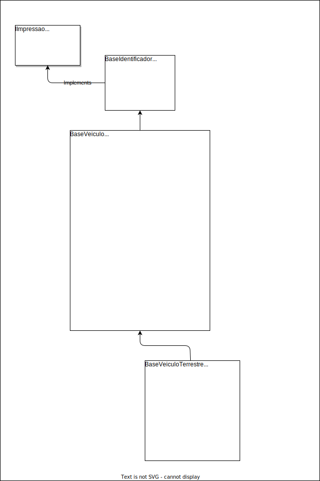

# Atividade 05

| Academico:    | [José A. Q. C. Gomes `@JoseComparotto`](https://github.com/JoseComparotto)                                                                   | RA: 398439413114     |
| ------------- | -------------------------------------------------------------------------------------------------------------------------------------------- | :------------------: |
| Curso:        | Engenharia da Computação                                                                                                                     | Noturno              |
| Professor:    | [Luiz Augusto Rodrigues `@profluizao`](https://github.com/profluizao)                                                                        |                      |
| Disciplina:   | Linguagem Orientada a Objetos                                                                                                                | 2023.2 - 4º Semestre |
| Universidade: | Anhanguera-Uniderp - Matriz                                                                                                                  | Campo Grande, MS     |
| Atividade:    | [Atividade 05](docs/LOO%20-%20Atividade%2005.pdf) | 06/09/2023           |

<h2 id="questao-a5-q1">Questão 01</h2>

O estagiário (mais uma vez) começou abstraindo um diagrama de classes de Veículos, mas novamente deixou para você realizar o trabalho dele. Desta vez, tudo o que ele pensou foram os atributos dos veículos. Porém, parece que ele não colocou a nomenclatura sugerida, não distribuiu os atributos, e relacionou classes cujos atributos não aparecem.

Usando o que você aprendeu em POO, análise os atributos, distribua nas classes relacionadas, reajustando atributos quando necessário, e crie o diagrama de classes no draw.io, salvando o resultado em PDF.

Após isso, crie um projeto Java chamado ProjetoVeiculosEstagiario, codifique as classes que você criou no diagrama, publique no GitHub, e mande o link para o professor.

