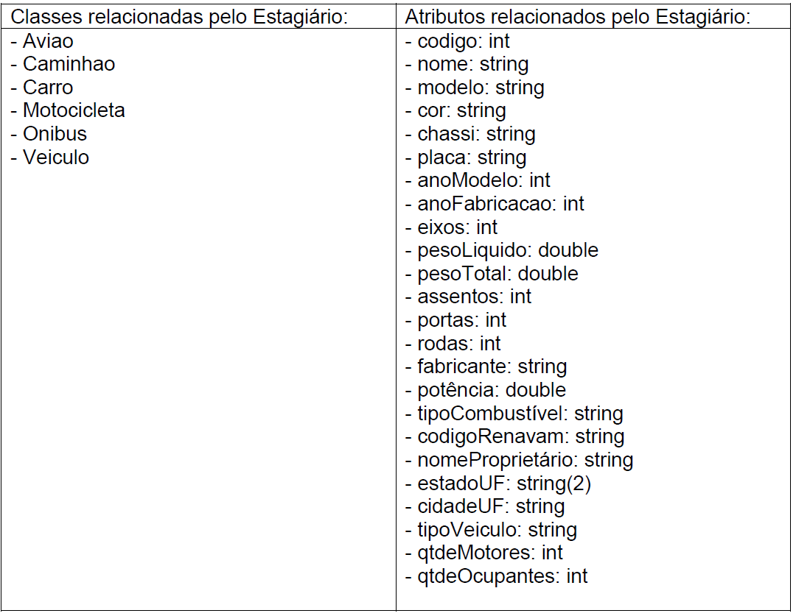
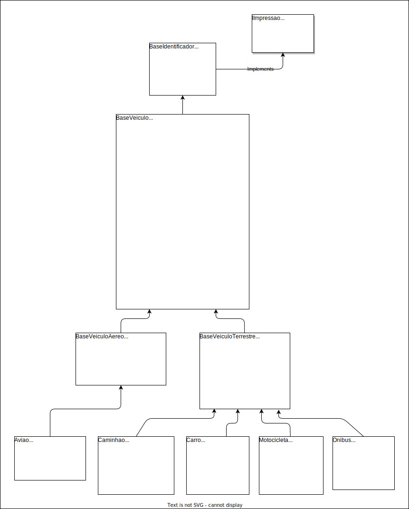

# Atividade 05

| Academico:    | [José A. Q. C. Gomes `@JoseComparotto`](https://github.com/JoseComparotto)                                                                   | RA: 398439413114     |
| ------------- | -------------------------------------------------------------------------------------------------------------------------------------------- | :------------------: |
| Curso:        | Engenharia da Computação                                                                                                                     | Noturno              |
| Professor:    | [Luiz Augusto Rodrigues `@profluizao`](https://github.com/profluizao)                                                                        |                      |
| Disciplina:   | Linguagem Orientada a Objetos                                                                                                                | 2023.2 - 4º Semestre |
| Universidade: | Anhanguera-Uniderp - Matriz                                                                                                                  | Campo Grande, MS     |
| Atividade:    | [Atividade 05](docs/LOO%20-%20Atividade%2005.pdf) | 06/09/2023           |

## Questão 01

O estagiário (mais uma vez) começou abstraindo um diagrama de classes de Veículos, mas novamente deixou para você realizar o trabalho dele. Desta vez, tudo o que ele pensou foram os atributos dos veículos. Porém, parece que ele não colocou a nomenclatura sugerida, não distribuiu os atributos, e relacionou classes cujos atributos não aparecem.

Usando o que você aprendeu em POO, análise os atributos, distribua nas classes relacionadas, reajustando atributos quando necessário, e crie o diagrama de classes no draw.io, salvando o resultado em PDF.

Após isso, crie um projeto Java chamado ProjetoVeiculosEstagiario, codifique as classes que você criou no diagrama, publique no GitHub, e mande o link para o professor.

### Resposta

#### 1ª Etapa

O primeiro tratamento necessário para a otimização do modelo é relacionar os atributos listados com as classes listadas.

Inicialmente identifiquei que os atributos `chassi`, `placa` e `codigoRenavam` não são, na minha consepção, aplicaveis à classe `Avião`. Portanto, separei os atributos em 2 grupos: os atributos que são aplicaveis a todas as classes, e os atributos que não são aplicaveis à classe `Avião`:

<table>
<thead><tr>
<th>Classes</th><th>Atributos</th>
</tr></thead>
<tbody>
<tr>
<td>

- Aviao
- Caminhao
- Carro
- Motocicleta
- Onibus
- Veiculo

</td><td>

- codigo: int
- nome: string
- modelo: string
- cor: string
- anoModelo: int
- anoFabricacao: int
- eixos: int
- pesoLiquido: double
- pesoTotal: double
- assentos: int
- portas: int
- rodas: int
- fabricante: string
- potência: double
- tipoCombustível: string
- nomeProprietário: string
- estadoUF: string(2)
- cidadeUF: string
- tipoVeiculo: string
- qtdeMotores: int
- qtdeOcupantes: int

</td>
</tr><tr><td>

- Caminhao
- Carro
- Motocicleta
- Onibus

</td><td>

- chassi: string
- placa: string
- codigoRenavam: string

</td>
</tr></tbody>
</table>

#### 2ª Etapa

Aplicando padrões de nomenclatura para otimizar a clareza do modelo.

- Adicionando o prefíxo `Base` nas classes abstratas.
- Removendo acentos/caracteres epeciais.
- Substituíndo abreviações por nomes diretos. (Prática pessoal)
- Uniformizando a coerência no padrão dos nomes.

<table>
<thead><tr>
<th>Classes</th><th>Atributos</th>
</tr></thead>
<tbody>
<tr>
<td>

- Aviao
- Caminhao
- Carro
- Motocicleta
- Onibus
- **Base**Veiculo

</td><td>

- codigo: int
- nome: string
- modelo: string
- cor: string
- anoModelo: int
- anoFabricacao: int
- **quantidade**Eixos: int
- pesoLiquido: double
- peso**Bruto** ~~Total~~: double
- **quantidade**Assentos: int
- **quantidade**Portas: int
- **quantidade**Rodas: int
- fabricante: string
- **potencia** ~~potência~~: double
- tipo**Combustivel** ~~Combustível~~: string
- nome**Proprietario** ~~Proprietário~~: string
- estado ~~UF~~: string(2)
- cidade ~~UF~~: string
- tipoVeiculo: string
- ~~qtde~~ **quantidade**Motores: int
- ~~qtde~~ **quantidade**Ocupantes: int

</td>
</tr><tr><td>

- Caminhao
- Carro
- Motocicleta
- Onibus

</td><td>

- chassi: string
- placa: string
- codigoRenavam: string

</td>
</tr></tbody>
</table>

#### 3ª Etapa

Incluíndo novas características:

- Como os atributos `chassi`, `placa` e `codigoRenavam` não são aplicaveis à classe `Aviao`, essa classe ficaria sem nenhum atributo que faça referência à uma identificação única na vida real. Para corrigir o problema, realizei uma pesquisa e descobri que existe um identificador único e com abrangencia internacional, que é regido e mantido pela [ICAO  (Organização da Aviação Civil Internacional)](https://www.icao.int/Pages/default.aspx). Este identificador sege o formato `#[#]-AAA` onde a primeira parte do código identifica o páis de origem, e pode 1 ou 2 caracteres, entre letras maiúsculas e números, e a segunda parte identifica a aeronave dentro do país e é formada por 3 letras maiusculas. Esta identificação será representada pelo atributo `matricula` do tipo `string`.  

- Na classe `Caminhao`, adicionarei propriedades exclusivas referente a carga que eles transportam: `tipoCarga: string` e `capacidadeCarga: string`.

- Na classe `Carro`, adicionarei as propriedades: `tipoCarroceria: string` e `tipoTracao: string`.

- Na classe `Motocicleta`, adicionarei as propriedades: `aroRodas: int` e `cilindradas: int`.

- Na classe `Onibus`, adicionarei as propriedades: `numeroLinha: int` e `nomeLinha: string`.

- Para testar o funcionamento das classes, adicionarei um método `imprimir` em todas as classes, que exibirá os valores de todas as propriedades do objeto. A maneira mais organizada de implementar isso é criando uma interface (`IImpressao`) que declara a assinatura desse método, e fazer com que todas as classes implementem este método.

#### 4ª Etapa

Montando o esquema de herança, considerando os atributos em comum e a semantica das entidades representadas.

Isolei o atributo `codigo` na classe `BaseIdentificador` para manter o padrão dos projetos anteriores e permitir a expansão do projeto possibilitando a inclusão de novas classes que tenham `codigo`, mas qu não representam veículos.

<table>
<tbody>
<tr>
<td colspan=5 style = "text-align: center"><i><b>IImpressao</b> &lt;&lt;interface&gt;&gt;</i></td>
</tr>
<tr>
<td colspan=5 style = "text-align: center"><i><b>BaseIdentificador</b> &lt;&lt;abstract&gt;&gt;</i></td>
</tr><tr>
<td colspan=5 style = "text-align: center"><i><b>BaseVeiculo</b> &lt;&lt;abstract&gt;&gt;</i></td>
</tr><tr>
<td colspan=1 style = "text-align: center"><i><b>BaseVeiculoAereo</b> &lt;&lt;abstract&gt;&gt;</i></td>
<td colspan=4 style = "text-align: center"><i><b>BaseVeiculoTerrestre</b> &lt;&lt;abstract&gt;&gt;</i></td>
</tr><tr>
<td colspan=1 style = "text-align: center"><b>Aviao</b></td>
<td colspan=1 style = "text-align: center"><b>Caminhao</b></td>
<td colspan=1 style = "text-align: center"><b>Carro</b></td>
<td colspan=1 style = "text-align: center"><b>Motocicleta</b></td>
<td colspan=1 style = "text-align: center"><b>Onibus</b></td>
</tr>
</tbody>
</table>

#### Diagrama Final

Compilando as alterações de todas as etapas, chego em um diagrama de classes final para o projeto.

