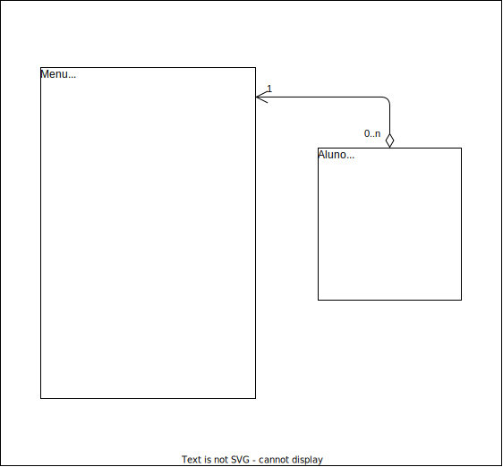

# Atividade 06 (A2)

| **Academico 1:** | [**José A. Q. C. Gomes `@JoseComparotto`**](https://github.com/JoseComparotto)  | **RA: 398439413114** |
| ---------------- | ----------------------------------------------------------------------------------- | :------------------: |
| **Academico 2:** | [**Yani Gabrielly Guerche Maricato `@YaniGuerche`**](https://github.com/YaniGuerche)           | **RA: 370430513114**   |
| Curso:           | Engenharia da Computação                                                            | Noturno              |
| Professor:       | [Luiz Augusto Rodrigues `@profluizao`](https://github.com/profluizao)               |                      |
| Disciplina:      | Linguagem Orientada a Objetos                                                       | 2023.2 - 4º Semestre |
| Universidade:    | Anhanguera-Uniderp - Matriz                                                         | Campo Grande, MS     |
| Atividade:       | [Atividade 06 (A2)](docs/LOO%20-%20Atividade%20A2%20-%20Atividade%20Enunciado.pdf) | 01/11/2023           |

## Orientações

Crie um programa em Linguagem Java, usando POO, que:

* Implemente uma classe Aluno, contendo código(int), nome(string), nota A1(double), nota P1(double), nota A2(double), nota P2(double), média (double).
* Desenvolva uma função para exibir um menu com as opções:
  * Opção 1 – Gerenciar Alunos
    * Opção 1 – Adicionar Aluno (informar apenas o código e o nome).
    * Opção 2 – Alterar nome do Aluno
    * Opção 3 – Excluir Aluno
    * Opção 4 – Listar todos.
    * Opção 5 – Selecionar um aluno da lista, para:
      * Opção 1 – Adicionar a nota A1 do aluno selecionado;
      * Opção 2 – Adicionar a nota P1 do aluno selecionado;
      * Opção 3 - Adicionar a nota A2 do aluno selecionado;
      * Opção 4 - Adicionar a nota P2 do aluno selecionado;
      * Opção 5 - Calcular a Média do Aluno (usando a fórmula abaixo), exibir o resultado, e se o aluno foi aprovado ou reprovado.
  * Opção 2 – Rendimento Escolar
    * Opção 1 – Selecionar um aluno da lista, para:
      * Exibir as notas de prova, de atividade e a média
    * Opção 2 – Exibir rendimento da turma (a lista toda, exibir as notas de prova, de atividade e a média).
  * Opção 9 - Sair, finalizando o programa.

> A média deve calculada da seguinte forma:
> ( ((P1 + A1)/2) + ((P2 + A2)/2) )/ 2.

## Escopo e Planejamento

1. Documentação (30min)
   1. Diagrama de Classes (30min)
2. Código-Fonte (2h 35min)
   1. Classe Aluno (10min)
      1. Atributos
      2. Metodos
   2. Funcionamento do Menu (1h)
   3. Criar Lista de Alunos (5min)
   4. Funções de Gerenciamento de alunos (1h)
      1. Adicionar (5min)
      2. Alterar (10min)
      3. Excluir (10min)
      4. Listar (5min)
      5. Definir notas: A1, P1, A2, P2 (30min)
   5. Funções de Rendimento Escolar (20min)
      1. Individual (10min)
      2. Turma (10min)
3. Roteiro Apresentação (30min)

### Carga Horária Estimada

Codificação: 2h 35h

Documentação e Roteiro: 1h

Estudo e Alinhamento: 3h

**Carga Total: 6h 35min**

## Diagrama de Classes

