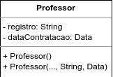

## Atividade 03

### Questão 01

Crie um programa que atenda a especificação dos diagramas abaixo.

<p align="center">
  
</p>

As classes abaixo devem ser derivadas da classe BasePessoa. Atenção para o construtor das classes Professor e Aluno.

<p align="center">
  
  
</p>

**Resposta:**

<https://github.com/JoseComparotto/loo/blob/98243d9cdab436cc9c1e5734b4f9fbb1edc640e1/src/main/java/loo/josecomparotto/aula03/atividade03/questao01/BasePessoa.java#L1-L107>

<https://github.com/JoseComparotto/loo/blob/98243d9cdab436cc9c1e5734b4f9fbb1edc640e1/src/main/java/loo/josecomparotto/aula03/atividade03/questao01/Aluno.java#L1-L41>

<https://github.com/JoseComparotto/loo/blob/98243d9cdab436cc9c1e5734b4f9fbb1edc640e1/src/main/java/loo/josecomparotto/aula03/atividade03/questao01/Professor.java#L1-L41>

### Questão 02

Considere o trecho de código abaixo.

```java
public abstract class BaseIdentificador {
    protected int id;

    public int getId() {
        return id;
    }

    public void setId(int id) {
        this.id = id;
    }

    public BaseIdentificador(int id) {
        this.id = id;
    }
}
```

```java
public class Subclasse extends Classe {
    protected String qualificador;

    public String getQualificador() {
        return qualificador;
    }

    public void setQualificador(String qualificador) {
        this.qualificador = qualificador;
    }

    public Subclasse(int id, String nome, String qualificador) {
        super(id, nome);
        this.qualificador = qualificador;
    }
}
```

```java
public class Produto extends Subclasse {
    protected String marcador;

    public String getMarcador() {
        return marcador;
    }

    public void setMarcador(String marcador) {
        this.marcador = marcador;
    }

    public Produto(int id, String nome, String qualificador, String marcador) {
        super(id, nome, qualificador);
        this.marcador = marcador;
    }
}
```

Marque a alternativa correta nas afirmações abaixo.

- A) Todas as instâncias de classe podem ser inicializadas corretamente.

- ***B) A propriedade `setId()`, da classe `Classe`, senão existir, não irá gerar  erro de compilação.***

- C) É correto considerar todas as classes representadas como instanciáveis, segundo os conceitos de Orientação a Objeto.

- D) É incorreto afirmar que a classe `Produto` herda atributos e propriedades das outras classes.

- E) O código está semanticamente incorreto, e compilará sem erros ou avisos.

**Resposta:** **B)** A propriedade `setId()`, da classe `Classe`, senão existir, não irá gerar erro de compilação.

**Justificativa**: A menos que o método esteja sendo chamado explicitamente em alguma linha de código do projeto, não é obrigatório implementar nenhum método getter ou setter. Apesar de que neste caso o metodo referido está implementado na classe `BaseIdentificador` e não na classe `Classe`.
