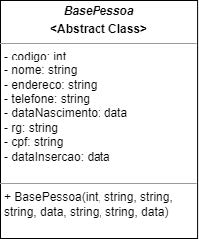
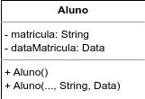

## Atividade 03

<table style="width: 100%;display: table;">
    <tbody>
        <tr>
            <td>Academico:</td>
            <td><a href="https://github.com/JoseComparotto">José A. Q. C. Gomes <code>@JoseComparotto</code></a></td>
            <td>RA: 398439413114</td>
        </tr>
        <tr>
            <td>Curso:</td>
            <td>Engenharia da Computação</td>
            <td>Turno: Noturno</td>
        </tr>
        <tr>
            <td>Professor:</td>
            <td><a href="https://github.com/profluizao">Luiz Augusto Rodrigues <code>@profluizao</code></a></td>
            <td></td>
        </tr>
        <tr>
            <td>Disciplina:</td>
            <td>Linguagem Orientada a Objetos</td>
            <td>Período: 2023.2 - 4º Semestre</td>
        </tr>
        <tr>
            <td>Atividade:</td>
            <td><a href="https://drive.google.com/file/d/1k2aJ5Dg0wNOXxJ28nRfaI1WddvbDFsry/view">Atividade 03</a></td>
            <td>23/08/2023</td>
        </tr>
    </tbody>
</table>

### Resumo

<table>
    <thead>
        <tr>
            <th><strong>Questão</strong></th>
            <th><strong><a href="#quest%C3%A3o-01">1</a></strong></th>
            <th><strong><a href="#quest%C3%A3o-02">2</a></strong></th>
            <th><strong><a href="#quest%C3%A3o-03">3</a></strong></th>
            <th><strong><a href="#quest%C3%A3o-04">4</a></strong></th>
            <th><strong><a href="#quest%C3%A3o-05">5</a></strong></th>
        </tr>
    </thead>
    <tbody>
        <tr>
            <td><strong>Resposta</strong></td>
            <td><a href="#resposta-q1">-</a></td>
            <td><a href="#resposta-q2">B</a></td>
            <td><a href="#resposta-q3">A</a></td>
            <td><a href="#resposta-q4">C</a></td>
            <td><a href="#resposta-q5">B</a></td>
        </tr>
    </tbody>
</table>

### Questão 01

Crie um programa que atenda a especificação dos diagramas abaixo.

<p align="center">
  
</p>

As classes abaixo devem ser derivadas da classe BasePessoa. Atenção para o construtor das classes Professor e Aluno.

<p align="center">
  
  
</p>

#### Resposta Q1

<https://github.com/JoseComparotto/loo/blob/98243d9cdab436cc9c1e5734b4f9fbb1edc640e1/src/main/java/loo/josecomparotto/aula03/atividade03/questao01/BasePessoa.java#L1-L107>

<https://github.com/JoseComparotto/loo/blob/98243d9cdab436cc9c1e5734b4f9fbb1edc640e1/src/main/java/loo/josecomparotto/aula03/atividade03/questao01/Aluno.java#L1-L41>

<https://github.com/JoseComparotto/loo/blob/98243d9cdab436cc9c1e5734b4f9fbb1edc640e1/src/main/java/loo/josecomparotto/aula03/atividade03/questao01/Professor.java#L1-L41>

### Questão 02

Considere o trecho de código abaixo.

```java
public abstract class BaseIdentificador {
    protected int id;

    public int getId() {
        return id;
    }

    public void setId(int id) {
        this.id = id;
    }

    public BaseIdentificador(int id) {
        this.id = id;
    }
}
```

```java
public class Subclasse extends Classe {
    protected String qualificador;

    public String getQualificador() {
        return qualificador;
    }

    public void setQualificador(String qualificador) {
        this.qualificador = qualificador;
    }

    public Subclasse(int id, String nome, String qualificador) {
        super(id, nome);
        this.qualificador = qualificador;
    }
}
```

```java
public class Produto extends Subclasse {
    protected String marcador;

    public String getMarcador() {
        return marcador;
    }

    public void setMarcador(String marcador) {
        this.marcador = marcador;
    }

    public Produto(int id, String nome, String qualificador, String marcador) {
        super(id, nome, qualificador);
        this.marcador = marcador;
    }
}
```

Marque a alternativa correta nas afirmações abaixo.

- A) Todas as instâncias de classe podem ser inicializadas corretamente.

- ***B) A propriedade `setId()`, da classe `Classe`, senão existir, não irá gerar  erro de compilação.***

- C) É correto considerar todas as classes representadas como instanciáveis, segundo os conceitos de Orientação a Objeto.

- D) É incorreto afirmar que a classe `Produto` herda atributos e propriedades das outras classes.

- E) O código está semanticamente incorreto, e compilará sem erros ou avisos.

#### Resposta Q2

```plain
B) A propriedade setId(), da classe Classe, senão existir, não irá gerar erro de compilação.
```

#### Justificativa Q2

```plain
A menos que o método esteja sendo chamado explicitamente em alguma linha de código do projeto, não é obrigatório implementar nenhum método getter ou setter. Apesar de que neste caso o metodo referido está implementado na classe BaseIdentificador e não na classe Classe.
```

### Questão 03

Observe o código abaixo, e marque Verdadeiro ou Falso nas afirmações a seguir.

```java
public class Calculadora {
    public int Somar(int numero1, int numero2) {
        return numero1 + numero2;
    }

    public int Subtrair(int numero1, int numero2) {
        return numero1 - numero2;
    }

    public int Multiplicar(int numero1, int numero2) {
        return numero1 * numero2;
    }

    public int Dividir(int numero1, int numero2) {
        return numero1 / numero2;
    }
}
```

- ***A) Se necessário, o programador pode criar uma instância dessa classe, facilitando assim sua operação, bastando adicionar a outra classe a linha de código: `Calculadora calc = new Calculadora()`***

- B) O uso da palavra reservada abstract não influencia a funcionalidade da classe.

- C) Os métodos poderiam ser declarados como `abstract`. Assim como está, o compilador irá informar que o código está errado.

- D) O uso da palavra abstract, tanto na classe como nos métodos, representa que a mesma pode ser chamada diretamente, sem que seja necessário criar uma instância para utilizá-la.

- E) Baseado na semântica e funcionalidade do código, a classe está escrita incorretamente, e compilará com erros e avisos

#### Resposta Q3

```plain
A) Se necessário, o programador pode criar uma instância dessa classe, facilitando assim sua operação, bastando adicionar a outra classe a linha de código: `Calculadora calc = new Calculadora()`
```

#### Justificativa Q3

```plain
O uso descrito na alternatva é plenamente válido, uma vez que a classe não é abstrata, logo pode ser instanciada diretamente. Além de que a única forma de acessar os métodos da classe é através de uma instancia, pois os métodos não são estáticos.
```

### Questão 04

Considerando a definição de um objeto, na Programação Orientada a Objetos, marque a alternativa correta nas afirmações que explicam a definição.

- A) Um objeto é uma rotina de programação contida em uma classe que pode ser chamada diversas vezes possibilitando assim reuso de código de programação.

- B) Um objeto é um conjunto de atributos primitivos tipados contido em uma classe.

- ***C) Um objeto é uma entidade que possui um estado e um conjunto definido de operações definidas para funcionar nesse estado.***

- D) Um objeto é um elemento de uma classe que representa uma operação (a implementação de uma operação).

- E) Um objeto é uma porção de código que resolve um problema muito específico, parte de um problema maior.

#### Resposta Q4

```plain
C) Um objeto é uma entidade que possui um estado e um conjunto definido de operações definidas para funcionar nesse estado.
```

#### Justificativa Q4

```plain
Dentre as alternativas, a letra "C" é a que melhor representa o conceito de objeto.
Esclaresendo que o estado mencionado é composto pelo conjunto dos valores de suas propriedades, assim como os métodos definidos em sua classe são as operações que são executadas no contexto do estado de cada objeto.
```

### Questão 05

> *O aumento da produtividade de desenvolvimento e a capacidade de compartilhar o conhecimento adquirido, representa uma vantagem no uso de projetos orientados a objeto.*

Marque a alternativa correta nas afirmações que explicam esse fato.

- A) um objeto pode ser chamado por objetos de classe diferente da sua.
- ***B) as classes podem ser potencialmente reutilizáveis.***
- C) as classes devem ser concretas ou abstratas.
- D) todo método pode ser derivado naturalmente das operações de sua classe.
- E) o encapsulamento impossibilita equívocos de código.

#### Resposta Q5

```plain
B) as classes podem ser potencialmente reutilizáveis.
```

#### Justificativa Q5

```plain
O conceito da Abstração envolve representar entidades da vida real (por exemplo). Isso por si só já torna o código mais organizado e menos trabalhoso de manter.
A reutilização de classes acontece por meio da Herança, que permite criar uma super-classe para simplificar a criação de várias classes com carácterísticas em comum.
```
